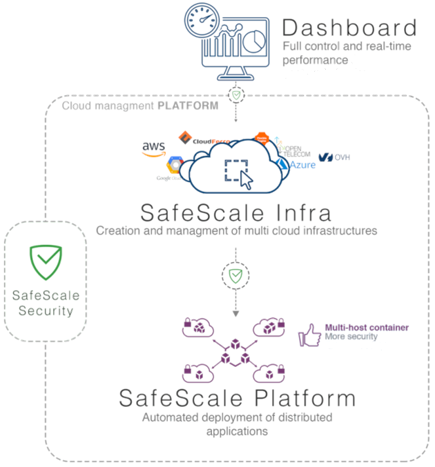
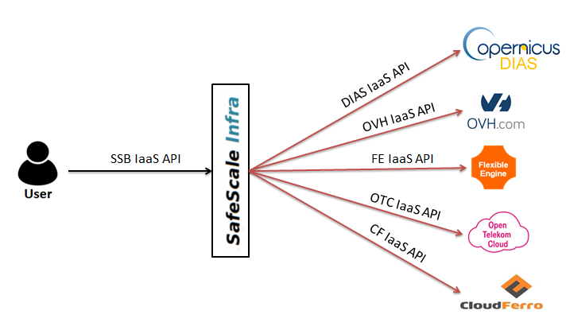
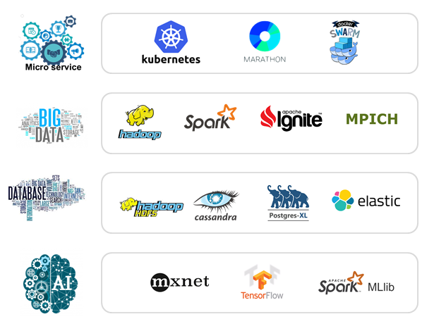
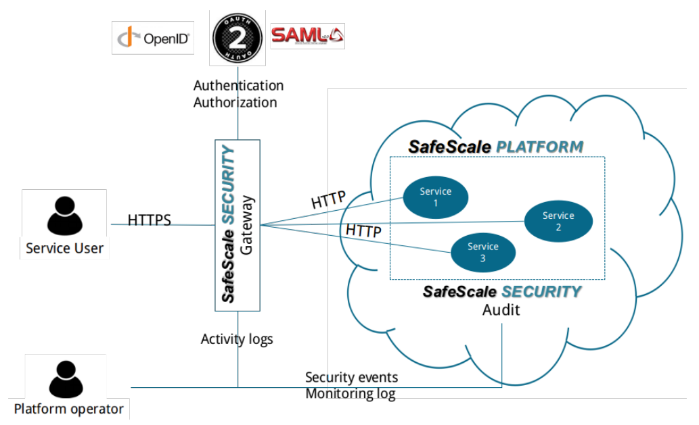

# SafeScale: multicloud management platform

SafeScale is an Infrastructure and Platform as a Code tool.

## Table of content
  - [Description](#description)
    - [SafeScale Infra](#safescale-safescale)
    - [SafeScale Perform](#safescale-perform)
    - [SafeScale Security](#safescale-security)
  - [Currently available features](#currently-available-features)
  - [Contributing](#contributing)
  - [License](#license)

## Description
SafeScale offers an APIs and a CLI tools to deploy versatile computing clusters that span multiple Clouds. These APIs and CLIs are divided in 3 service layers:

- SafeScale Infra to manage Cloud infrastructure
- SafeScale Perform to manage Cloud computing platforms
- SafeScale Security to secure user environments

### SafeScale Infra

SafeScale Infra offers an API to completely abstract the IaaS services offered by Cloud platforms providers.
It allows to:

- Create / Destroy private networks, Create routers, Manage firewall
- Create / Destroy hosts,
- Create / Destroy block and object storage,
- Mount / Unmount object storage as file system,
- Create / Destroy shares, Connect / Disconnect host to/from shares,
- Create / Destroy clusters
- Add / Remove "features" (software components) on hosts and clusters

SafeScale Broker provides a complete abstraction overlay over underlying IaaS APIs to mask their heterogeneity.

### SafeScale Perform

The concept of SafeScale Perform revolves around the offer of an API to create on-demand computing platforms. These platforms are built to by highly versatile providing all necessary building blocks to create a cutting-edge, production grade, scalable and highly available services: Micro service orchestration, Big Data and HPC computing frameworks, large scale data management, AI training and inference frameworks.

The innovative aspect of SafeScale Perform platforms lies in their capacity to offer a combined usage of a large variety of frameworks and technologies without having to manage resources allocation (Node, RAM, CPU, and GPU).
SafeScale Perform platforms resource management is centralized by Apache Mesos which guarantees a fair and efficient distribution of resources for all components hosted by the platform. This particularity enables SafeScale users to run concurrently services and compute loads of data without worrying about their partitioning over the nodes of the cluster and thus significantly accelerate the implementation of complex distributed services.
A corollary of the centralized resource management system is that it allows the combined usage of various computing and service management frameworks which greatly simplifies the porting of in-house applications to the Cloud.
It is also important to precise that SafeScale Perform platforms are not static, they can be up-scale and down scaled on-demand or automatically to adapt to load fluctuations and thus to optimize IT costs.

### SafeScale Security

SafeScale Security is a Web API and a Web Portal to create on-demand security gateways to protect Web services along 5 axes: Encryption, Authentication, Authorization, Auditability and Intrusion detection.
SafeScale Security relies on Kong, an open source generic proxy to be put in between user and service. Kong intercepts user requests and service responses and executes plugins to empower any API. To build a SafeScale Security gateway 3 plugins are used:
- Dynamic SSL plugin to encrypt traffic between the user and the service protected
- Open ID plugin to connect the Identity and Access Management server, KeyCloak
- UDP Log plugin to connect the Log management system, Logstash
The design of a SafeScale Security gateway can be depicted as bellow:

## Currently available features
SafeScale is currently under active development and does not yet offer all the features planned. However, we are already publishing it with the following features:

  - SafeScale Infra:
    - Create / Destroy private networks
    - Create / Destroy hosts,
    - Create / Destroy block and object storage,
    - Mount object storage on file system,
    - Create Shares, Connect/disconnect host to share,
    - Create / Destroy clusters composed of a network, servers and services
      currently supported:
        - Swarm cluster
        - BOH = Bunch Of Hosts (without any cluster management layer)
      coming soon:
        - DCOS (with or without Kubernetes)
        - Kubernetes
        - OHPC
    - Add / Remove "features" on host and clusters

 - Support Cloud providers:
    - OVH Public Cloud
    - FlexibleEngine
    - OpenTelekom
    - CloudWatt
    - CloudFerro
    - Generic OpenStack
    - AWS: under development

## Contributing

We are strongly interested by new contributions.

If you wish to contribute you can [fork the project](https://help.github.com/forking/), make your changes, commit to your repository, and then [create a pull request](https://help.github.com/articles/creating-a-pull-request-from-a-fork/). The development team can then review your contribution and commit it upstream as appropriate.

For bugs and feature requests, [please create an issue](../../issues/new).

## Build
  [See Build file](doc/build/BUILDING.md)

## Usage
  [See Usage file](doc/USAGE.md)

## License

SafeScale is distributed by [CS Systemes d'Information](http://www.c-s.fr) under the [Apache License, Version 2.0](LICENSE). Please see the [third-party notices](NOTICE) file for additional copyright notices and license terms applicable to portions of the software.